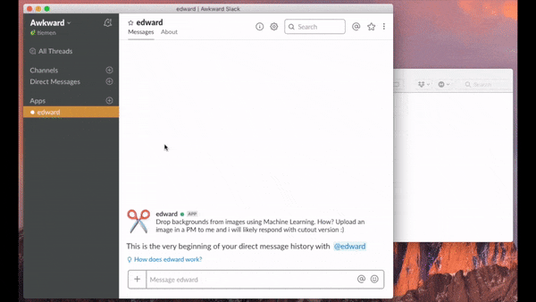

<br />
<br />

[](https://travis-ci.com/Tmw/edward)

**Edward Scissorhands** is a slackbot that utilizes machinelearning to remove the background of any uploaded image. Edward works best with images containing people.



## Edward's brain 🧠

Edward depends on a pre-trained Tensorflow model as explained in this [blogpost](https://towardsdatascience.com/background-removal-with-deep-learning-c4f2104b3157). The fully pre-trained model can be found over their Gitlab [Repository](https://gitlab.com/fast-science/background-removal-server/tree/master/webapp/model).

_Note; the model in this repository is merely a mirror. In both cases; pull using [git lfs](https://git-lfs.github.com/)._

# Running from Docker

By far the easiest way to run Edward is by using Docker. Pull the image directly from [Dockerhub](https://hub.docker.com/r/tiemenwaterreus/edward), give Edward a `SLACK_TOKEN` and we're off to the races!

**Example:**

```bash
docker run -it --rm \
  -e "SLACK_TOKEN=<your_slack_token>" \
  tiemenwaterreus/edward
```

_Where `<your_slack_token>` is replaced with your bot's Slack Token_

# Obtaining a `slack_token`

Getting a slack (bot) token is easy; just browse to [create bot integration](https://my.slack.com/services/new/bot) page on Slack, give your bot an username (eg: `edward`) and hit the green button. Hooray! You just made a Slack (bot) integration!

On the next page you can customize your integration some more by providing an icon and a short description. The most important piece is the `API Token` near the top. Its a pretty long string which starts with `xoxb-`. Copy this token and pass it in the `env`-variables of edward.

# Run from Source

```bash
git clone https://github.com/tmw/edward.git && cd edward
```

#### Running Tests

```bash
scripts/edward test
```

#### Running Edward locally

Make sure you fill in the missing pieces in your `.env` file and simply run:

```bash
scripts/edward run
```

> _if you don't have an .env file, create one by looking at the example (`.example.env`)_

#### Build & push

```bash
scripts/edward build
scripts/edward push
```

# Environment Variables

For additional tweaks, edward is taking the following environment variables into account when booting up:

| Variable    | Type   | Meaning                        |
| ----------- | ------ | ------------------------------ |
| SLACK_TOKEN | String | Your slack token               |
| THREADS     | Int    | How many threads do we reserve |
